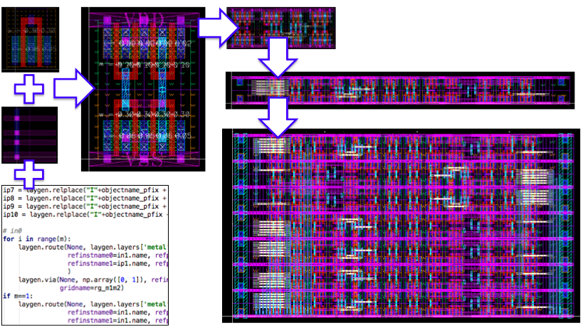
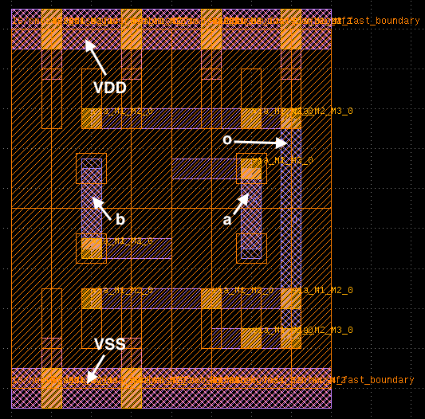

# LAYGO - LAYout with Gridded Objects

## Introduction


Laygo is an add-on to [BAG2](https://github.com/ucb-art/BAG_framework)
framework, which helps designers generate physical designs (layouts) of integrated
circuits (IC) automatically, and boost the design productivity of modern IC 
designs in advanced CMOS processes.
 
Laygo nicely abstracts the complex design rules (which take the most efforts to 
be cleaned up manually) by introducing template and grid concepts; layout objects 
are abstracted with their size and port information, and are placed on 
predefined grids to meet design rules by placement, with their routing 
wires are placed on grids as well. Designers combine these technology-specific 
templates and grids with technology-independent laygo scripts to produce 
process-portable and parameterized layouts. The laygo layout generators are 
written in Python, which provides higher productivity and flexibility to your 
generators.

The initial versions of laygo have been developed by 
[Jaeduk Han](https://jdhan.github.io/),  Woorham Bae, Zhongkai Wang, Eric Jan, 
and researchers at 
[Berkeley Wireless Research Center](https://bwrc.eecs.berkeley.edu) (BWRC). The 
laygo is currently maintained by Jaeduk Han at Hanyang University.


## Getting Started
1. Install BAG2 (skip if you are using the GDS flow).
2. Clone the laygo repository.
    ```
    $ git clone git@github.com:ucb-art/laygo.git
    ```
3. Prepare the following setup files for your technology.
    * **laygo_config.yaml** - contains general technology information.

        An example file can be found here  [labs/laygo_config.yaml](https://github.com/ucb-art/laygo/blob/master/labs/laygo_config.yaml)
    * **(technology_name).layermap** - (optional) the layer mapping file 
    needed for the GDS flow. Usually the layermap file can be found in your 
    PDK library.

        An example layermap file can be found here [labs/laygo_faketech.layermap](https://github.com/ucb-art/laygo/blob/master/labs/laygo_faketech.layermap)
    * **primitive template and grid database files** : contains primitive template
    and grid information in YAML format. 

        Example database files can be found here: 
        [labs/laygo_faketech_microtemplates_dense_templates.yaml](https://github.com/ucb-art/laygo/blob/master/labs/laygo_faketech_microtemplates_dense_templates.yaml),
        [labs/laygo_faketech_microtemplates_dense_grids.yaml](https://github.com/ucb-art/laygo/blob/master/labs/laygo_faketech_microtemplates_dense_grids.yaml)

        The primitive template and grid yaml files can be generated from running the 
        following script with the primitive templates and grids constructed by user
        (check lab2 for details):        
        [labs/lab2_a_gridlayoutgenerator_constructtemplate.py](https://github.com/ucb-art/laygo/blob/master/labs/lab2_a_gridlayoutgenerator_constructtemplate.py)

    Complete sets of these setup files for example technologies can be found here:

        [cds_ff_mpt](git@github.com:ucb-art/BAG2_cds_ff_mpt.git)
        [NCSU FreePDK45](git@github.com:ucb-art/BAG2_freePDK45.git)

    **For BWRC users,** default setup files for various technologies are
    provided under proper NDAs.

4. Now you are ready to run a toy script and generate a simple nand gate layout. 
    Launch ipython and run the GDS tutorial script
    [quick_start_GDS.py](https://github.com/ucb-art/laygo/blob/master/quick_start_GDS.py).
    ```
    $ start_bag.sh    (or ipython)
    > cd laygo
    > run quick_start_GDS.py
    ```
    It will create a nand gate layout, and save it to *output.gds*.

    

    [KLayout](http://www.klayout.de/) was used to display the generated gds file. 
    Detailed explanations on the tutorial script can be found
    [here](https://ucb-art.github.io/laygo/tutorial/tutorial_GDS.html).
    You can also export the layout to the BAG framework. Check
    [this document](https://ucb-art.github.io/laygo/tutorial/tutorial_BAG.html)
    for the details of the BAG flow.

## Documentation
* A complete API documentation can be found [here](https://ucb-art.github.io/laygo/).

* Check the following papers for the successful IC generation history using laygo:

    [1] E. Chang et al., ["BAG2: A process-portable framework for generator-based AMS circuit design,"](https://ieeexplore.ieee.org/document/8357061/)
in Proc. IEEE CICC, Apr. 2018.

    [2] J. Han et al., "A generated 7 GS/s 8 b time-interleaved SAR ADC with 38.2 dB SNDR at Nyquist in 16 nm CMOS FinFET," 
in Proc. IEEE CICC, Apr. 2019.

* Several bootcamp sessions are held at BWRC and other places to introduce laygo to public. 
Check [here](images/BAG_bootcamp_laygo.pdf) to download the bootcamp slides.

## Labs
Various lab modules are provided to help designers understand the laygo-based layout 
generation process. Check [this link](https://ucb-art.github.io/laygo/lab/lab.html) for details.

## Example Generators
Example generaters are summarized [here](https://ucb-art.github.io/laygo/example/example.html).

## License
This project is licensed under the BSD License - check the
[LICENSE](LICENSE) file for details.

